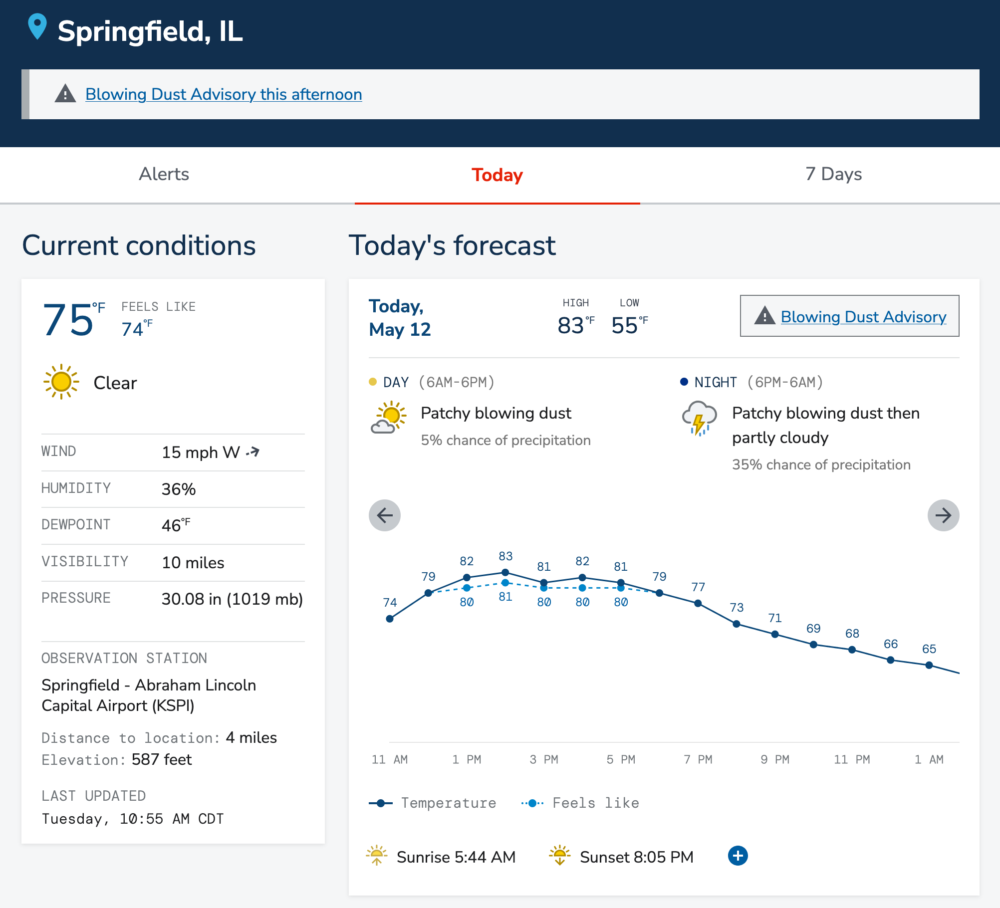

<!-- .slide: class="title" -->

# Introduction to APIs

The infrastructure that makes the internet work

---
<!-- .slide: class="section" -->

# What is it?

API stands for "application programming interface." An
API is a contract describing what data a service provides
and how to interact with it.<!-- .element: class="left" -->

You're familiar with this idea.<!-- .element: class="left" -->

---
<!-- .slide: class="content" -->

# APIs are like outlets

An outlet comes with a specification for what shape of plug
it takes, and what will happen when you plug it in. For
example: 

<!-- .element: class="center" -->

A US-style electrical outlet has three slots. Two of them are
vertical slits and the other is a round hole. If you plug into
this outlet, you will get an A/C current at 60 hertz and 120 volts.

---
<!-- .slide: class="content" -->

# APIs are like outlets

We can string together different outlets to do interesting things.
Like we can plug a machine into an electrical outlet, a water
outlet, and a drain outlet, and now we can combine all those
things to wash our clothes.

<!-- .element: class="center" -->

You don't have to know where the water comes from or where it
goes or how the electricity is produced. Those things are
hidden behind the outlets.

---
<!-- .slide: class="section" -->

# What's that got to do with computers?

Different computers have different data. What if all that
data could be connected?

---
<!-- .slide: class="content four-dots" -->

# Using APIs to get the weather

The National Weather Service is a great example. They collect
data from many sources in order to provide a complete picture
of the weather.

* ## Weather stations
  There are tens of thousands of little stations measuring the
  current conditions, like temperature and wind.

* ## Alerts platform
  Weather alerts, such as severe thunderstorm warnings, are
  generated by forecasters through an alerting platform.

* ## Forecast models
  Forecasts are generated by supercomputers running simulations
  every few hours.

* ## Discussions
  Forecasters write plain-language information describing
  upcoming weather risks.

---
<!-- .slide: class="content" -->

# Using APIs to get the weather

Those four data sources are disparate systems. But they each
have APIs that allow the National Weather Service to pull
all the data together to create a single, easy-to-understand
forecast website.

<!-- .element: class="big" -->
<!-- .element: class="center" -->

---
<!-- .slide: class="summary" -->

Importantly, the team that builds the National Weather Service
website <strong>doesn't have to collect the current conditions or
generate forecasts</strong>. They don't even have to know how they are
created. They only have to know that it exists and how to get it.

They also get the freshest data automatically. No human
intervention is required: the website can fetch the most
appropriate data on its own.

---
<!-- .slide: class="section" -->

# APIs allow different systems to connect their data

A lot of work at STO revolves around taking data from two
or more systems and combining or reconciling them. But what
if those systems shared their data automatically so the
people could spend less time putting data together and more
time <em>using</em> that data?

---
<!-- .slide: class="content" -->

# Some STO systems

* 529 College Savings
* ABLE
* ADP
* Budget
* Community Invest
* Secure Choice
* Student Empowerment Fund
* Unclaimed Property

What if they shared data? The 529/UP program is bridging
two systems to make it easier for people to claim their
unclaimed property and put it to work.

What if the budget could automatically pull employee data
directly from ADP?

---
<!-- .slide: class="content" -->

# What if smarter spreadsheets?

What if the various systems that track investments,
spending, budget, etc., could share their data? What
if a single audit system could pull that data at any
time and highlight discrepancies? What if the system
could pull the data automatically at regular intervals
and notify someone if anything is wonky?