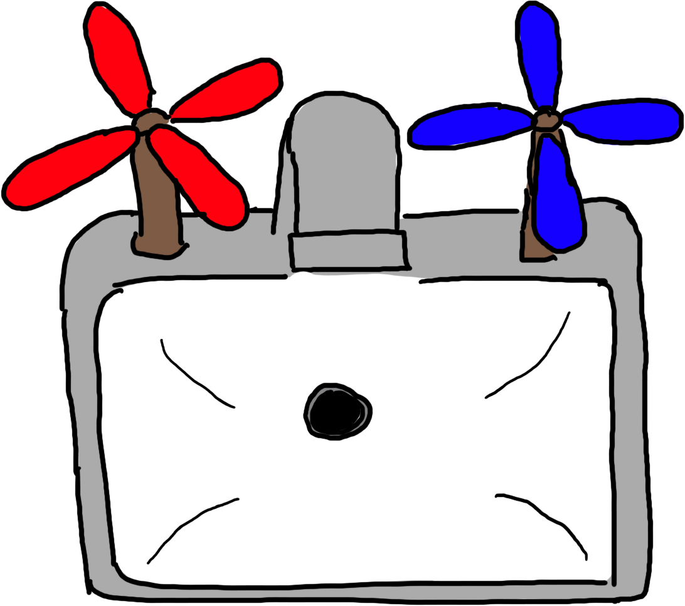
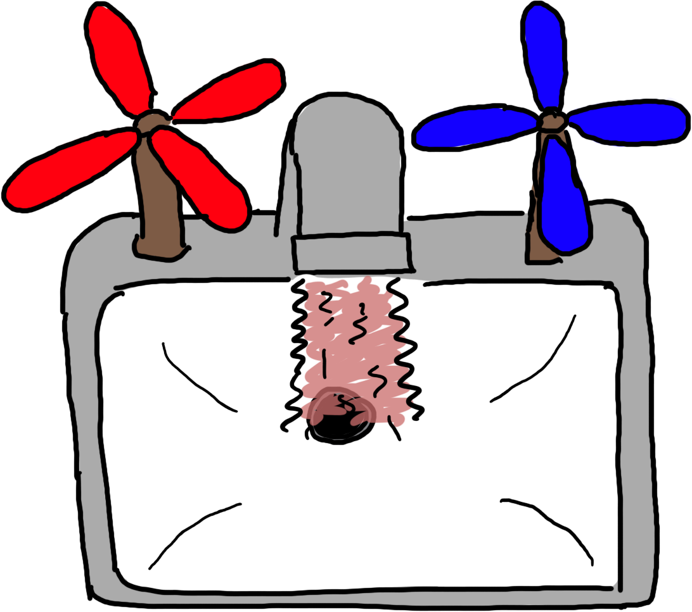
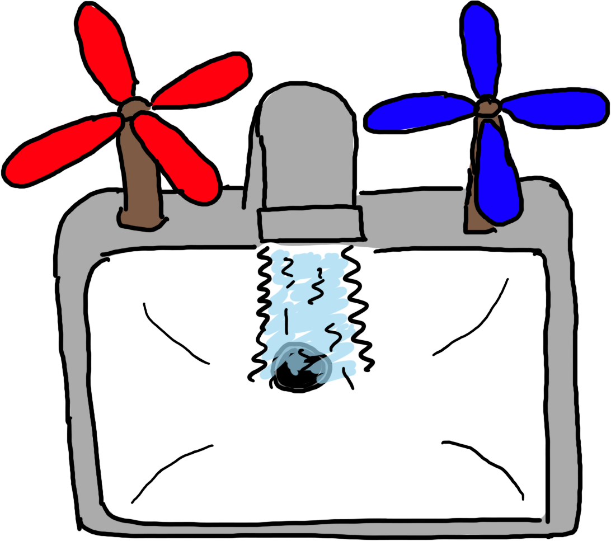
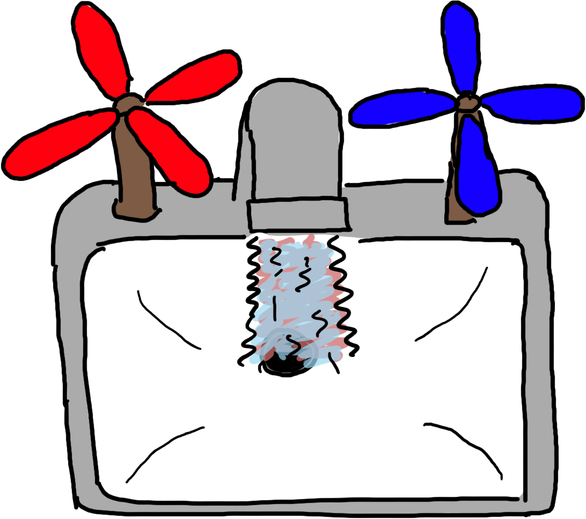

<!-- .slide: class="title" -->

# Introduction to APIs

how computers talk to each other

---
<!-- .slide: class="section" -->

# What is it?

API stands for "application programming interface." They
are how computers exchange information. APIs let systems
publish data they have, and can include controls for
formatting or filtering the data.

---
<!-- .slide: class="content four-dots" -->
APIs allow us to build systems that do one or two things
really well and then connect various systems together to
do more complex tasks. This has some benefits:

* ## Maintainability
  Because each piece does a relatively simple and isolated
  task, it's easier to maintain over time.

* ## Abstraction
  When you're using someone else's data, you don't have to
  know about how it was collected or processed.

* ## Testable
  Smaller pieces doing simpler logic are easier to understand
  and test, leading to higher confidence that they work.

* ## Independence
  Letting external systems handle specific needs makes it
  easier to swap them out over time.

Notes:
* ## Maintainability
  Because each piece does a relatively simple and isolated
  task, it's easier to maintain over time.

* ## Abstraction
  When you're using someone else's data, you don't have to
  know about how it was collected or processed.

* ## Testable
  Smaller pieces doing simpler logic are easier to understand
  and test, leading to higher confidence that they work.

* ## Independence
  Letting external systems handle specific needs makes it
  easier to swap them out over time.

APIs are also an important thing to look for in software
procurements. When you buy something with good APIs, it
can enable you to move to different software later because
the APIs can help you get your data out. There are even
well-worn software engineering techniques for migrating
from one software system to another if they both have APIs.

---
<!-- .slide: class="content" -->

# Getting water

<!-- .element: class="big" -->
<!-- .element: class="center" -->

Note: So imagine you're standing at this weird-looking
sink. You need to wash your hands.

---
<!-- .slide: class="content" -->

# Getting water

<!-- .element: class="big" -->
<!-- .element: class="center" -->

Note: So you twist the red knob and you get hot water.
In this analogy, you've just made a request to the API:
give me hot water, and out it pops. But this isn't the
water you want to wash your hands with, it'll burn.

---
<!-- .slide: class="content" -->

# Getting water

<!-- .element: class="big" -->
<!-- .element: class="center" -->

Note: You turn off the red knob and twist the blue one.
This time you've requested cold water from the "API",
and you have it. But this is too cold.

---
<!-- .slide: class="content" -->

# Getting water

<!-- .element: class="big" -->
<!-- .element: class="center" -->

Note: You twist them both on a little bit and get exactly
the right temperature of water. APIs are like this. They
can have several different kinds of data available, and
they can let you mix and match to get exactly what it is
you need.

---
<!-- .slide: class="content four-dots" -->

# You don't have to care about the rest

You got the water you wanted without having to worry
about where it came from, how it was processed, how
it was pumped, what kind of plumbing it went through,
etc. You just turned a knob and there was water.

* ## Maintainability
  The water processing facility can be fixed without you
  having to replace your sink. Truly a win for the ages.

* ## Abstraction
  The city can change water sources or how they treat the
  water supply and you don't even have to know about it.

* ## Testable
  We can test the depth of the reservoir, the filtration
  of the treatment facility, and the pressure at your
  faucet, each independently.

* ## Independence
  Want to switch from well water to city water? You don't
  need a new faucet!

Notes:
* ## Maintainability
  The water treatment facility can be fixed without you
  having to replace your sink, but they also don't need
  to know anything about your sink. And if your sink
  starts to leak, you can patch it up without needing to
  do anything at the water source.

  Imagine if instead of all these pieces of a water system,
  what if you had to collect the water yourself, filter it,
  and pump it up to pressure. And I know this is true for
  some people. When something goes wrong at the sink, you
  have to check the pump, the filters, and even your water
  supply.

* ## Abstraction
  Abstraction also means that I'm not responsible for fixing
  the water filtration system. I'm just hooked up to it.
  It helps draw clearer boundaries of who is responsible for
  what. When you just have one big system, that system bears
  a lot of responsibility.

  Somewhat tangentially, this can also be a political hot
  potato. If there's one big system, who is responsible for
  it? Whose name? That can be a difficult or contentious
  question: maybe nobody wants their name attached to it,
  or maybe different people want to claim specific parts of
  it. Smaller systems connected via APIs reduce the
  individual risk and also make it easier for domain
  experts to have control over their piece without having
  to accept responsibility for everything else.

* ## Testable
  There are a lot of pieces involved in getting water from
  wherever it is into your house. Because we have lots of
  small systems connected by pipes, we can test each piece
  by disconnecting the pipes and controlling the input
  to verify the output. And we can do that in isolation, so
  we're sure that the thing we're tesitng is responsible
  for the output we're measuring.

  If a water treatment facility needed to be tested for
  efficacy, you could disconnect it from the water system.
  Then put in dirty water with known contaminants and
  measure what comes out. You don't need to rely on the
  quality of the water source, and you don't need to worry
  about sending dirty water into people's homes.

* ## Independence
  Want to switch from well water to city water? You don't
  need a new faucet! And if you do want a new faucet? You
  don't need permission from the water supplier.
---
<!-- .slide: class="content" -->

## Data is water, APIs are pipes

If you want to know the current yield on 30 year
treasuries, you can just ask for that. If you want
to know the temperature in Goofy Ridge, IL,
 you can
find it without having to know how it was measured.
If you want to know where the International Space
Station is, you can look it up and you don't need to
know anything about astronomy.
<!-- .element: class="line-height-15" -->

---
<!-- .slide: class="section" -->

# A real example

The National Weather Service operates an API that
provides access to over 10 million forecast points,
tens of thousands of current conditions, every
weather alert that gets published, and bunches more.
It receives tens of millions of requests every
single day.

[api.weather.gov](https://api.weather.gov/)

---
<!-- .slide: class="content" -->

# A real example

<iframe src="https://api.weather.gov" style="width: 80vw; height: 70vh;">
</iframe>

Notes: This is a live look at api.weather.gov. The page we're
looking at is documentation of all the kinda of data that you
can get from the National Weather Service.

This is a particular kind of API, called a REST API. When
people talk about APIs today, they generally mean REST. What
makes these cool is that they are just web pages.

---
<!-- .slide: class="content" -->

# A real example

Current conditions in Goofy Ridge, IL:  
https://api.weather.gov/stations/KPIA/observations?limit=1

<pre class="code-wrapper"><code class="language-json" data-temperature-raw></code></pre>

Notes: And this is – again, live – the data that the weather
API returned for the current weather conditions near Goofy
Ridge.

If you open the URL up above in your web browser, this is
what you'll see. This is in a data format called Jay-Sohn,
spelled J-S-O-N. It is a format intended for computers to
read, but it is not too bad for humans either. Anyway, these
APIs being essentially just web pages is very important
because it demonstrates how easy they are to use.

Now looking at this data a little bit, we can see the
current weather, we can scroll down here and see the current
temperature in Celsius. Wind speed. And so on.

If you were to visit beta.weather.gov right now, it is using
this API to collect all of the data it uses to show your
forecast page. This way, the team responsible for the website
doesn't have to be responsible for also maintaining accurate
observations or severe weather alerts – instead, that team
only has to focus on making the data easy to understand.
There are several daunting tasks tied up in this, but there
are also several distinct teams and systems sharing the load.

---
<!-- .slide: class="section" -->

# APIs allow different systems to connect their data

A lot of work at STO revolves around taking data from two
or more systems and combining or reconciling them. But what
if those systems shared their data automatically so the
people could spend less time putting data together and more
time <em>using</em> that data?

---
<!-- .slide: class="content" -->

# Some STO systems

* 529 College Savings
* ABLE
* ADP
* Budget
* Community Invest
* Secure Choice
* Student Empowerment Fund
* Unclaimed Property

What if they shared data? The 529/UP program is bridging
two systems to make it easier for people to claim their
unclaimed property and put it to work.

What if the various systems that track investments,
spending, budget, etc., could share their data? What
if a single audit system could pull that data at any
time and highlight discrepancies? What if that happened
automatically at regular intervals?

---
<!-- .slide: class="title" -->

# What STO data
# could be connected?

---

<!-- .slide: class="title" -->
# Questions/discussion
